# NEC UNIVERGE IX
BGP4+に未対応のため、IPv6での接続はできません。IPv6を利用したい場合は、Static Routingを利用してください

## 構成
アンダーレイ: NGN(IPv6 RA方式)  
トンネリング: EtherIP  
ルータ: IX2215

Flet'sのONUをIX2215 GigaEthernet0に接続し、IX2215 GigaEthernet2にサーバを接続します。  
ServerへのIPアドレスの割り当てはDHCPを利用します。  
NEC UNIVERGE IXでSSHやTELNET、SNMP機能などを利用する際は、適切なACL設定を行ってください。

```mermaid
architecture-beta

    service onu(clarity:hard-disk-solid)[ONU]
    service IX2215(clarity:router-solid)[GE0 IX2215 GE2]
    service server(clarity:server-solid)[Server]

    onu:R -- L:IX2215
    IX2215:R -- L:server

```


## デフォルトルート
- 例示環境
  - サンプルコンフィグ内の値は、以下の仮定の下、設定しています。実際に投入する際は、ダッシュボードの値をもとに、適宜変更してください。
  - 割り当てIPv4 Prefix: 192.0.2.0/29
    - ルータのIPv4アドレス: 192.0.2.6/29
    - DHCPサーバの割り当て範囲:
      - 開始: 192.0.2.1
      - 終了: 192.0.2.5
  - トンネル用IPv4 Prefix: 192.0.2.254/31
    - 弊団体側IPv4アドレス: 192.0.2.254/31
    - 貴団体側IPv4アドレス: 192.0.2.255/31
  - 貴団体側ASN: 64512
  - 弊団体側トンネル終端アドレス: 2001:db8:3::1
  - ネームサーバのIPアドレス(お好みで設定してください): 198.51.100.1
  - IPv6 Interface Identifier: 00:00:00:00:00:00:00:01
```
! NEC Portable Internetwork Core Operating System Software
! IX Series IX2215 (magellan-sec) Software, Version 10.7.18, RELEASE SOFTWARE
! Compiled Oct 25-Tue-2022 12:37:13 JST #2
! Current time Jan 02-Thu-2014 04:53:28 JST
!
timezone +09 00
!
!
ip ufs-cache enable
! GigaEthernet2がdownでもルートを広報する
ip route 192.0.2.0/29 Null0.0
ip dhcp enable
ip prefix-list pref-out 10 permit 192.0.2.0/29
ip prefix-list pref-out 20 deny any
ip access-list proxy-dns permit ip src 192.0.2.0/29 dest any
ip access-list proxy-dns deny ip src any dest any
!
!
ipv6 ufs-cache enable
!
!
!
!       
bridge irb enable
!
!
!
!
!
proxy-dns ip enable
proxy-dns ip access-list proxy-dns
proxy-dns server 198.51.100.1
!
!
!
ip dhcp profile server1
  assignable-range 192.0.2.1 192.0.2.5
  default-gateway 192.0.2.6
  dns-server 192.0.2.6
!
router bgp 64512
  neighbor 192.0.2.254 remote-as 59105
  address-family ipv4 unicast
    neighbor 192.0.2.254 distribute-list pref-out out
    network 192.0.2.0/29
!
device GigaEthernet0
!
device GigaEthernet1
!
device GigaEthernet2
!
device BRI0
  isdn switch-type hsd128k
!
device USB0
  shutdown
!
interface GigaEthernet0.0
  no ip address
  ipv6 enable
! 以下のコマンドで、IPv6アドレスのインターフェースIDを指定する
  ipv6 interface-identifier 00:00:00:00:00:00:00:01
  ipv6 address autoconfig receive-default
  ipv6 traffic-class tos 0
  bridge-group 1
  no shutdown
!
interface GigaEthernet1.0
  no ip address
  shutdown
!
interface GigaEthernet2.0
  ip address 192.0.2.6/29
  ip dhcp binding server1
  no shutdown
!
interface BRI0.0
  encapsulation ppp
  no auto-connect
  no ip address
  shutdown
!
interface USB-Serial0.0
  encapsulation ppp
  no auto-connect
  no ip address
  shutdown
!
interface BVI1
  ip address 192.0.2.255/31
  bridge-group 1
  no shutdown
!
interface Loopback0.0
  no ip address
!
interface Null0.0
  no ip address
!
interface Tunnel0.0
  tunnel mode ether-ip ipv6
  tunnel destination 2001:db8:3::1
  no ip address
  bridge-group 1
! 以下のMSS値は、MTUが1500の場合の値です。MTUが異なる場合は適宜調整してください。
  bridge ip tcp adjust-mss 1404
  no shutdown
!
```

## フルルート
機器の性能上、フルルートを受信することはできません。

## 補足: MSSについて
config中に、以下のようにIPv4 TCPのMSSを指定している箇所があります。参考までに計算方法を紹介します。
```
interface Tunnel0.0
! 以下のMSS値は、MTUが1500の場合の値です。MTUが異なる場合は適宜調整してください。
  bridge ip tcp adjust-mss 1404
```

```
1500 -         40        -        2       -        14       -        20         -     20     = 1404
 MTU   Outer IPv6 Header   EtherIP Header   Ethernet Header   Inner IPv4 Header   TCP Header    MSS
単位: byte
```

また、MSS計算の際には、運営委員の須山が作成した計算サイトもよろしければご利用ください。
https://nw-tools.suyama.ne.jp/mtu-calculator/

## 免責事項
本資料は参考情報です。これらの情報によって被ったいかなる損害については、弊団体は一切の責任を負いません。十分なご検証の上ご利用ください。  
また、必要に応じてセキュリティの設定を行ってください。  
なお、弊団体では、接続に関する機器の設定のサポートなどは行なっておりませんので、ご了承ください。  
