# Cisco 841M Advanced Security
Advanced SecurityライセンスではBGP4+に未対応のため、IPv6での接続はできません。IPv6を利用したい場合は、Static Routingを利用してください。なお、Advanced IP Servicesのライセンスがある場合は、BGP4+を利用することができます。

## 構成
アンダーレイ: NGN(IPv6 RA方式)  
トンネリング: GRE  
ルータ: Cisco 841M Advanced Security

Flet'sのONUを841M GigabitEthernet 0/4に接続し、GigabitEthernet 0/0にサーバを接続します。  
ServerへのIPアドレスの割り当てはDHCPを利用します。  
SSHやTELNET、SNMP機能などを利用する際は、適切なACL設定を行ってください。

```mermaid
architecture-beta

    service onu(clarity:hard-disk-solid)[ONU]
    service router(clarity:router-solid)[GE04 841M GE00]
    service server(clarity:server-solid)[Server]

    onu:R -- L:router
    router:R -- L:server

```


## デフォルトルート
- 例示環境
  - サンプルコンフィグ内の値は、以下の仮定の下、設定しています。実際に投入する際は、ダッシュボードの値をもとに、適宜変更してください。
  - 割り当てIPv4 Prefix: `192.0.2.0 255.255.255.248`
    - ルータのIPv4アドレス: `192.0.2.6 255.255.255.248`
  - トンネル用IPv4 Prefix: `192.0.2.254 255.255.255.254`
    - 弊団体側IPv4アドレス: `192.0.2.254 255.255.255.254`
    - 貴団体側IPv4アドレス: `192.0.2.255 255.255.255.254`
  - 貴団体側ASN: `64512`
  - 弊団体側トンネル終端アドレス: `2001:db8:3::1`
  - ネームサーバのIPアドレス(お好みで設定してください): `198.51.100.1`
  - NGN側のIPv6アドレス: `2001:db8:4::1/64`
    - NGNから割り当てられたプレフィックスを使用してください。
    - NGNから割り当てられたプレフィックスを確認するには、
      ```
      interface GigabitEthernet0/4
        ipv6 address autoconfig default
      exit
      ```
      というコンフィグを一時的に投入し、`show ipv6 interface GigabitEthernet0/4`コマンドでIPv6アドレスを確認してください。
    - 例: 以下の場合、`2409:252:3260:2100::/64 `がプレフィックスです。
      ```
      Router#show ipv6 interface GigabitEthernet0/4
      GigabitEthernet0/4 is up, line protocol is up
        IPv6 is enabled, link-local address is FE80::2E5A:FFF:FEEE:2A93 
        No Virtual link-local address(es):
        Global unicast address(es):
          2409:252:3260:2100::CAFE:1, subnet is 2409:252:3260:2100::/64 
      ```
  - NGNの収容ルータのリンクローカルIPv6アドレス: `FE80::212:E2FF:FEF0:6218`
    - NGNの収容ルータのリンクローカルIPv6アドレスは、上記と同様のコンフィグを一時的に投入し、`show ipv6 route`コマンドでデフォルトルートがどのアドレスに向いているかを確認してください。
    - 例: 以下の場合、`FE80::212:E2FF:FEF0:6218`がNGNの収容ルータのリンクローカルIPv6アドレスです。
    ```
    Router(config)#do show ipv6 route
    IPv6 Routing Table - default - 5 entries
    Codes: C - Connected, L - Local, S - Static, U - Per-user Static route
           HA - Home Agent, MR - Mobile Router, R - RIP, ND - ND Default
           NDp - ND Prefix, DCE - Destination, NDr - Redirect, la - LISP alt
           lr - LISP site-registrations, ld - LISP dyn-eid, lA - LISP away
           a - Application
    ND  ::/0 [2/0]
         via FE80::212:E2FF:FEF0:6218, GigabitEthernet0/4
    ```
```
Router#show run
Building configuration...

Current configuration : 2261 bytes
!
! Last configuration change at 11:36:41 UTC Sun Mar 30 2025
!
version 15.9
! 不要なサービスを停止
no service pad
service timestamps debug datetime msec localtime
service timestamps log datetime msec localtime
service password-encryption
service sequence-numbers
!
hostname Router
!
boot-start-marker
boot-end-marker
!
!
!
no aaa new-model
!
!
no ip source-route
!
!
!
ip dhcp excluded-address 192.0.2.6
!
ip dhcp pool pool1
 network 192.0.2.0 255.255.255.248
 default-router 192.0.2.6
 dns-server 198.51.100.1
!
!
!
no ip bootp server
no ip domain lookup
ip cef
ipv6 unicast-routing
ipv6 cef
!
!
license udi pid C841M-4X-JSEC/K9 sn <シリアル番号>
!
!
!
redundancy
!
!
!
!
! 不要なサービスを停止
no cdp run
!
! 
!
!
!
!
!
!
!
!
!
interface Tunnel0
 ip address 192.0.2.255 255.255.255.254
! 不要な機能の停止
 no ip redirects
 no ip unreachables
 no ip proxy-arp
 ip tcp adjust-mss 1416
 tunnel source GigabitEthernet0/4
 tunnel mode gre ipv6
 tunnel destination 2001:db8:3::1
!
interface GigabitEthernet0/0
 switchport mode access
 no ip address
!
interface GigabitEthernet0/1
 switchport mode access
 no ip address
!
interface GigabitEthernet0/2
 switchport mode access
 no ip address
!
interface GigabitEthernet0/3
 switchport mode access
 no ip address
!
interface GigabitEthernet0/4
 no ip address
 no ip redirects
 no ip unreachables
 no ip proxy-arp
 duplex auto
 speed auto
! NGNのIPv6アドレスを手動設定
 ipv6 address 2001:db8:4::1/64
 ipv6 enable
! IPv6のRAを停止
 ipv6 nd ra suppress all
 no ipv6 redirects
 no ipv6 unreachables
!
interface GigabitEthernet0/5
 no ip address
 shutdown
 duplex auto
 speed auto
!
interface Vlan1
 ip address 192.0.2.6 255.255.255.248
 no ip redirects
 no ip unreachables
 no ip proxy-arp
!
router bgp 64512
 bgp log-neighbor-changes
 neighbor 192.0.2.254 remote-as 59105
 !
 address-family ipv4
  network 192.0.2.0 mask 255.255.255.248
  neighbor 192.0.2.254 activate
  neighbor 192.0.2.254 prefix-list AS64512 out
 exit-address-family
!
ip forward-protocol nd
no ip http server
no ip http secure-server
!
!
! GigabitEthernet0/0-0/3がdownでもルートを広報する(ルーティングテーブルにルートを載せておく)
ip route 192.0.2.0 255.255.255.248 Null0
!
!
ip prefix-list AS64512 seq 5 permit 192.0.2.0/29
! IPv6のデフォルトゲートウェイを設定
ipv6 route ::/0 GigabitEthernet0/4 FE80::212:E2FF:FEF0:6218
!
!
!
line con 0
 no modem enable
line vty 0 4
 login
 transport input none
!
scheduler allocate 20000 1000
!
end
```

## フルルート
機器の性能上、フルルートを受信することはできません。

## 補足: MSSについて
config中に、以下のようにIPv4 TCPのMSSを指定している箇所があります。参考までに計算方法を紹介します。
```
interface Tunnel0
 ip tcp adjust-mss 1416
```

```
1500 -         40        -      4     -         20        -     20     = 1416
 MTU   Outer IPv6 Header   GRE Header   Inner IPv4 Header   TCP Header    MSS
単位: byte
```

また、MSS計算の際には、運営委員の須山が作成した計算サイトもよろしければご利用ください。
https://nw-tools.suyama.ne.jp/mtu-calculator/

## 免責事項
本資料は参考情報です。これらの情報によって被ったいかなる損害については、弊団体は一切の責任を負いません。十分なご検証の上ご利用ください。  
また、必要に応じてセキュリティの設定を行ってください。  
なお、弊団体では、接続に関する機器の設定のサポートなどは行なっておりませんので、ご了承ください。  