# VyOS

## 構成
ハードウェア: SOPHOS XG135  
ソフトウェア: **VyOS 1.5***  
アンダーレイ: NGN(IPv6 RA方式)  
トンネリング: GRE  

\* バージョンによってコマンドが一部異なる場合があります。また、`inserfaces <if type> <if name> ipv6 address interface-identifier <id>` コマンドは、現在実装中のため使用できません。実装が完了していたら投入してください。https://github.com/vyos/vyos-1x/pull/4392

Flet'sのONUをVyOS eth0に接続し、VyOS eth1-eth8にサーバを接続します。  
ServerへのIPアドレスの割り当ては、IPv4はDHCP、IPv6はRAとDHCPv6を利用します。  
SSHやTELNET、SNMP機能などを利用する際は、適切なACL設定を行ってください。

```mermaid
architecture-beta

    service onu(clarity:hard-disk-solid)[ONU]
    service router(clarity:router-solid)[eth0 SOPHOS XG135 eth1 eth8]
    service server(clarity:server-solid)[Server]

    onu:R -- L:router
    router:R -- L:server

```


## デフォルトルート
- 例示環境
  - サンプルコンフィグ内のIPアドレスは、以下の仮定の下、設定しています。実際に投入する際は、ダッシュボードの値をもとに、適宜変更してください。
  - 割り当てIPv4 Prefix: 192.0.2.0/29  
    - ルータのIPv4アドレス: 192.0.2.6/29
    - DHCPサーバの割り当て範囲:
      - 開始: 192.0.2.1
      - 終了: 192.0.2.5
  - 割り当てIPv6 Prefix: 2001:db8:1::/56
    - ルータのIPv6アドレス: 2001:db8:1::fffe/64
  - トンネル用IPv4 Prefix: 192.0.2.254/31
    - 弊団体側IPv4アドレス: 192.0.2.254/31
    - 貴団体側IPv4アドレス: 192.0.2.255/31
  - トンネル用IPv6 Prefix: 2001:db8:2::/64
    - 弊団体側IPv6アドレス: 2001:db8:2::1/64
    - 貴団体側IPv6アドレス: 2001:db8:2::2/64
  - 貴団体側ASN: 64512
  - 弊団体側トンネル終端アドレス: 2001:db8:3::1
  - ネームサーバのIPアドレス(お好みで設定してください): 198.51.100.1
  - IPv6 Interface Identifier: 0000:0000:0000:0001
  - NGN IPv6 Prefix: 2001:db8:4::
- 変数
  - サンプルコンフィグ内の変数は以下の通りです。実際に投入する際は、ダッシュボードの値をもとに、もしくは実際の環境をもとに、適宜変更してください。
```
interfaces {
    bridge br0 {
        address 192.0.2.6/29
        address 2001:db8:1::fffe/64
        member {
            interface eth1 {
            }
            interface eth2 {
            }
            interface eth3 {
            }
            interface eth4 {
            }
            interface eth5 {
            }
            interface eth6 {
            }
            interface eth7 {
            }
            interface eth8 {
            }
        }
    }
    ethernet eth0 {
        ipv6 {
            address {
                autoconf
                interface-identifier 0000:0000:0000:0001
            }
        }
        vrf NGN
    }
    tunnel tun0 {
        address 192.0.2.255/31
        address 2001:db8:2::2/64
        encapsulation ip6gre
        ip {
            adjust-mss 1416
        }
        ipv6 {
            adjust-mss 1396
        }
        parameters {
            ipv6 {
                encaplimit none
            }
        }
        remote 2001:db8:3::1
        source-address 2001:db8:4::0000:0000:0000:0001
        source-interface eth0
    }
}
policy {
    prefix-list AS64512 {
        rule 10 {
            action permit
            prefix 192.0.2.0/29
        }
    }
    prefix-list6 AS64512 {
        rule 10 {
            action permit
            prefix 2001:db8:1::/56
        }
    }
    route-map EXPORT-AS59105 {
        rule 10 {
            action permit
            match {
                ip {
                    address {
                        prefix-list AS64512
                    }
                }
            }
        }
        rule 20 {
            action permit
            match {
                ipv6 {
                    address {
                        prefix-list AS64512
                    }
                }
            }
        }
        rule 30 {
            action deny
        }
    }
}
protocols {
    bgp {
        address-family {
            ipv4-unicast {
                network 192.0.2.0/29 {
                }
            }
            ipv6-unicast {
                network 2001:db8:1::/56 {
                }
            }
        }
        neighbor 192.0.2.254 {
            address-family {
                ipv4-unicast {
                    route-map {
                        export EXPORT-AS59105
                    }
                    soft-reconfiguration {
                        inbound
                    }
                }
            }
            remote-as 59105
        }
        neighbor 2001:db8:2::1 {
            address-family {
                ipv6-unicast {
                    route-map {
                        export EXPORT-AS59105
                    }
                    soft-reconfiguration {
                        inbound
                    }
                }
            }
            remote-as 59105
        }
        system-as 64512
    }
}
service {
    dhcp-server {
        shared-network-name SERVER1 {
            authoritative
            subnet 192.0.2.0/29 {
                option {
                    default-router 192.0.2.6
                    name-server 192.0.2.6
                }
                range RANGE1 {
                    start 202.226.7.153
                    stop 202.226.7.157
                }
                subnet-id 1
            }
        }
    }
    dhcpv6-server {
        shared-network-name SERVER1 {
            subnet 2001:db8:1::/64 {
                interface br0
                option {
                    name-server 2001:db8:1::fffe
                }
                subnet-id 1
            }
        }
    }
    dns {
        forwarding {
            allow-from 192.0.2.0/29
            allow-from 2001:db8:1::/64
            listen-address 2001:db8:1::fffe
            listen-address 192.0.2.6
            name-server 198.51.100.1 {
            }
            no-serve-rfc1918
        }
    }
    router-advert {
        interface br0 {
            other-config-flag
            prefix 2001:db8:1::/64 {
            }
        }
    }
}
vrf {
    name NGN {
        table 100
    }
}
```

投入用
```
set interfaces bridge br0 address '192.0.2.6/29'
set interfaces bridge br0 address '2001:db8:1::fffe/64'
set interfaces bridge br0 member interface eth1
set interfaces bridge br0 member interface eth2
set interfaces bridge br0 member interface eth3
set interfaces bridge br0 member interface eth4
set interfaces bridge br0 member interface eth5
set interfaces bridge br0 member interface eth6
set interfaces bridge br0 member interface eth7
set interfaces bridge br0 member interface eth8
set interfaces ethernet eth0 ipv6 address autoconf
set interfaces ethernet eth0 ipv6 address interface-identifier '0000:0000:0000:0001'
set interfaces ethernet eth0 vrf 'NGN'
set interfaces tunnel tun0 address '192.0.2.255/31'
set interfaces tunnel tun0 address '2001:db8:2::2/64'
set interfaces tunnel tun0 encapsulation 'ip6gre'
set interfaces tunnel tun0 ip adjust-mss '1416'
set interfaces tunnel tun0 ipv6 adjust-mss '1396'
set interfaces tunnel tun0 parameters ipv6 encaplimit 'none'
set interfaces tunnel tun0 remote '2001:db8:3::1'
set interfaces tunnel tun0 source-address '2001:db8:4::0000:0000:0000:0001'
set interfaces tunnel tun0 source-interface 'eth0'
set policy prefix-list AS64512 rule 10 action 'permit'
set policy prefix-list AS64512 rule 10 prefix '192.0.2.0/29'
set policy prefix-list6 AS64512 rule 10 action 'permit'
set policy prefix-list6 AS64512 rule 10 prefix '2001:db8:1::/56'
set policy route-map EXPORT-AS59105 rule 10 action 'permit'
set policy route-map EXPORT-AS59105 rule 10 match ip address prefix-list 'AS64512'
set policy route-map EXPORT-AS59105 rule 20 action 'permit'
set policy route-map EXPORT-AS59105 rule 20 match ipv6 address prefix-list 'AS64512'
set policy route-map EXPORT-AS59105 rule 30 action 'deny'
set protocols bgp address-family ipv4-unicast network 192.0.2.0/29
set protocols bgp address-family ipv6-unicast network 2001:db8:1::/56
set protocols bgp neighbor 192.0.2.254 address-family ipv4-unicast route-map export 'EXPORT-AS59105'
set protocols bgp neighbor 192.0.2.254 address-family ipv4-unicast soft-reconfiguration inbound
set protocols bgp neighbor 192.0.2.254 remote-as '59105'
set protocols bgp neighbor 2001:db8:2::1 address-family ipv6-unicast route-map export 'EXPORT-AS59105'
set protocols bgp neighbor 2001:db8:2::1 address-family ipv6-unicast soft-reconfiguration inbound
set protocols bgp neighbor 2001:db8:2::1 remote-as '59105'
set protocols bgp system-as '64512'
set service dhcp-server shared-network-name SERVER1 authoritative
set service dhcp-server shared-network-name SERVER1 subnet 192.0.2.0/29 option default-router '192.0.2.6'
set service dhcp-server shared-network-name SERVER1 subnet 192.0.2.0/29 option name-server '192.0.2.6'
set service dhcp-server shared-network-name SERVER1 subnet 192.0.2.0/29 range RANGE1 start '192.0.2.1'
set service dhcp-server shared-network-name SERVER1 subnet 192.0.2.0/29 range RANGE1 stop '192.0.2.5'
set service dhcp-server shared-network-name SERVER1 subnet 192.0.2.0/29 subnet-id '1'
set service dhcpv6-server shared-network-name SERVER1 subnet 2001:db8:1::/64 interface 'br0'
set service dhcpv6-server shared-network-name SERVER1 subnet 2001:db8:1::/64 option name-server '2001:db8:1::fffe'
set service dhcpv6-server shared-network-name SERVER1 subnet 2001:db8:1::/64 subnet-id '1'
set service dns forwarding allow-from '192.0.2.0/29'
set service dns forwarding allow-from '2001:db8:1::/64'
set service dns forwarding listen-address '2001:db8:1::fffe'
set service dns forwarding listen-address '192.0.2.6'
set service dns forwarding name-server 198.51.100.1
set service dns forwarding no-serve-rfc1918
set service router-advert interface br0 other-config-flag
set service router-advert interface br0 prefix 2001:db8:1::/64
set vrf name NGN table '100'
```

## フルルート
機器のメモリ容量によっては動作しません。参考までに、4GB程度あれば動作すると思われます。

コンフィグは、デフォルトルートと同様です。

## 補足: MSSについて
config中に、以下のようにTCPのMSSを指定している箇所があります。参考までに計算方法を紹介します。
```
set interfaces tunnel tun0 ip adjust-mss '1416'
set interfaces tunnel tun0 ipv6 adjust-mss '1396'
```

```
IPv4:  
1500 -         40        -      4     -         20        -     20     = 1416
 MTU   Outer IPv6 Header   GRE Header   Inner IPv4 Header   TCP Header    MSS

IPv6:  
1500 -         40        -      4     -         40        -     20     = 1396
 MTU   Outer IPv6 Header   GRE Header   Inner IPv6 Header   TCP Header    MSS
単位: byte
```

また、MSS計算の際には、運営委員の須山が作成した計算サイトもよろしければご利用ください。
https://nw-tools.suyama.ne.jp/mtu-calculator/

## 免責事項
本資料は参考情報です。これらの情報によって被ったいかなる損害については、弊団体は一切の責任を負いません。十分なご検証の上ご利用ください。  
また、必要に応じてセキュリティの設定を行ってください。  
なお、弊団体では、接続に関する機器の設定のサポートなどは行なっておりませんので、ご了承ください。  
